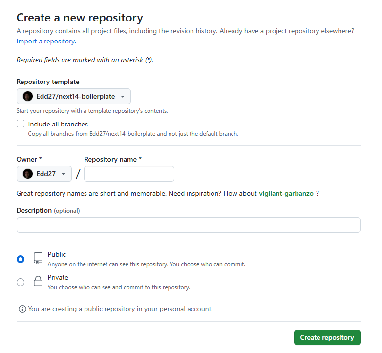

# Next.js boilerplate

This GitHub project template is designed to help you get started quickly with Next.js.

## Demo

You can see the demo project on [this link](https://next-template.edgarbenavides.dev/)

## Technologies

[](https://nextjs.org/)
[](https://www.typescriptlang.org/)
[](https://www.prisma.io/)
[](https://eslint.org/)
[](https://prettier.io/)
[](https://next-auth.js.org/)
[](https://ui.shadcn.com/docs/components/accordion)

## Getting started

### Option 1: Use template on GitHub

1. Fork this project

2. Create new project and select this template as repository template:



### Option 2: Create new project

1. Create a new project using `create-next-app` tool with this command

   ```bash
   npx create-next-app@latest --example "https://github.com/Edd27/next14-boilerplate" [name-of-your-project]
   ```

## Run the boilerplate

### Manually

1. Create a `.env` file from `.env.example`, then update variables values.

   ```bash
   cp .env.example .env
   ```

2. Install the project dependencies:

   ```bash
   npm install
   ```

3. Push prisma schema to the database.

   ```bash
   npx prisma db push
   ```

4. Seed database:

   ```bash
   npx prisma db seed
   ```

5. Run server on dev mode:

   ```bash
   npm run dev
   ```

6. Access the app at:
   ```bash
   http://localhost:3000
   ```

### Using Docker

1. Create `.env.development` and `.env.production` files:

   ```bash
   cp .env.example .env.development
   cp .env.example .env.production
   ```

   > NOTE: Update the `.env.development` and `.env.production` files

2. Run the app using Docker Compose:

   ```bash
   docker compose --env-file .env.development up -d --build
   ```

3. Access the app at:
   ```bash
   http://localhost:3000
   ```

## Testing

Teste the app with the following credentials:

- Username:

  ```
  edgar
  ```

- Password:

  ```
  admin12345
  ```

## License

This project is open-source and released under the [MIT License](https://choosealicense.com/licenses/mit/).
